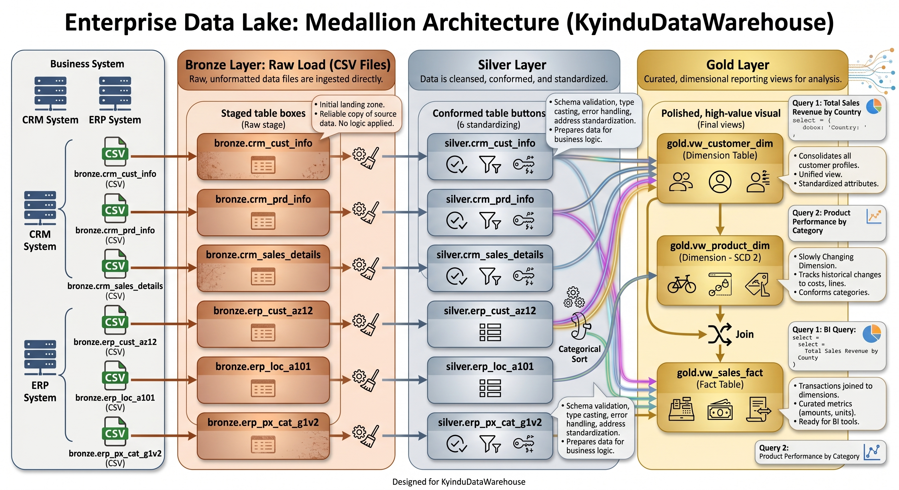
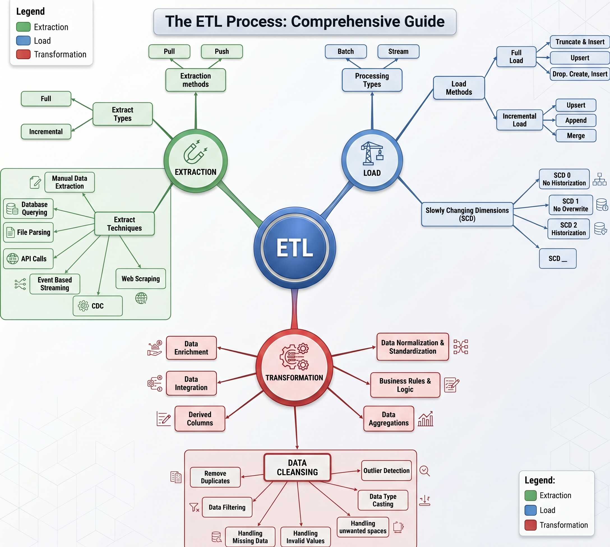

# SQL Data Warehouse Project

A production-grade data warehouse built entirely in **SQL Server**, designed to demonstrate industry-standard practices in **dimensional modeling**, **layered ETL**, and **stored-procedure-driven transformations**. The project ingests messy data from two source systems — an **ERP** and a **CRM** — and turns it into clean, conformed, business-ready datasets that analysts can query with confidence.

It is intended as a portfolio-quality reference for how a real data warehouse is organized end-to-end: not just the SQL, but the architecture, naming conventions, lineage, and operational patterns around it.

---

## Table of Contents

- [Architecture](#architecture)
- [Data Flow](#data-flow)
- [Project Structure](#project-structure)
- [Data Model](#data-model)
- [Naming Conventions](#naming-conventions)
- [Tech Stack](#tech-stack)
- [Getting Started](#getting-started)
- [ETL Patterns](#etl-patterns)
- [API Ingestion](#api-ingestion)
- [Data Quality & Validation](#data-quality--validation)
- [Roadmap](#roadmap)
- [License](#license)

---

## Architecture

The warehouse follows the **Medallion Architecture** — a layered approach popularized by modern data platforms — adapted here for SQL Server.

```
┌──────────────┐     ┌──────────────┐     ┌──────────────┐     ┌──────────────┐
│   SOURCES    │ ──► │   BRONZE     │ ──► │   SILVER     │ ──► │    GOLD      │
│  CRM + ERP   │     │   (Raw)      │     │  (Cleansed)  │     │  (Business)  │
│   CSV files  │     │ As-ingested  │     │ Standardized │     │ Star schema  │
└──────────────┘     └──────────────┘     └──────────────┘     └──────────────┘
                         BULK              stored procs          views / facts
                        INSERT             transformations       & dimensions
```

| Layer      | Purpose                                                                 | Load Pattern        |
| ---------- | ----------------------------------------------------------------------- | ------------------- |
| **Bronze** | Land raw source data unchanged for full auditability and replay.        | Full load (truncate + insert) via `BULK INSERT` |
| **Silver** | Cleanse, deduplicate, standardize types and business keys.              | Full load via stored procedures |
| **Gold**   | Expose star-schema facts and dimensions as views for BI consumption.    | Views (no materialization) |

### Medallion Architecture Diagram



---

## Data Flow

1. **Ingest** — Two ingestion paths land data in Bronze:
   - **File-based:** CSVs from CRM and ERP are bulk-loaded into Bronze tables that mirror the source structure (`BULK INSERT`).
   - **API-based:** A Python ingestion script pulls from REST APIs (e.g. FX rates) and lands raw rows in `bronze.api_*` tables. See [API Ingestion](#api-ingestion).
2. **Cleanse** — Silver stored procedures handle trimming, casing, null handling, type coercion, deduplication, and surrogate-key generation.
3. **Model** — Gold layer exposes conformed dimensions (`dim_customers`, `dim_products`) and a fact table (`fact_sales`) as views, ready for analytics tools.
4. **Consume** — Downstream BI / SQL clients query Gold only. Bronze and Silver are internal.

---

## Project Structure

```
Data-WareHouse-Project/
├── datasets/                  # Raw source CSVs (CRM + ERP)
│   ├── source_crm/
│   └── source_erp/
│
├── scripts/
│   ├── init_database.sql      # Creates DataWarehouse DB and bronze/silver/gold schemas
│   ├── bronze/
│   │   ├── ddl_bronze.sql     # Bronze CRM/ERP table definitions
│   │   ├── ddl_bronze_api.sql # Bronze API-sourced table definitions
│   │   └── proc_load_bronze.sql
│   ├── silver/
│   │   ├── ddl_silver.sql     # Silver table definitions
│   │   └── proc_load_silver.sql
│   ├── gold/
│   │   └── ddl_gold.sql       # Gold views (dimensions + facts)
│   └── ingest/                # Python API ingestion
│       ├── api_ingest.py
│       ├── requirements.txt
│       └── .env.example
│
├── tests/                     # Data-quality validation queries
│   ├── quality_checks_silver.sql
│   └── quality_checks_gold.sql
│
├── docs/                      # Diagrams, data dictionary, lineage
│   ├── data_lake.jpg          # Enterprise Data Lake: Medallion Architecture diagram
│   ├── etl.jpg                # The ETL Process: Comprehensive Guide diagram
│   └── data_catalog.md        # Data dictionary and lineage
│
└── README.md
```

---

## Data Model

The **Gold layer** is modeled as a classic **star schema** for analytical workloads.

**Dimensions**
- `gold.dim_customers` — conformed customer attributes from CRM + ERP
- `gold.dim_products`  — current product catalog with category hierarchy

**Facts**
- `gold.fact_sales` — sales transactions grain: one row per order line

Each dimension uses a **surrogate key** (`ROW_NUMBER()` over a stable business key) so that facts join on integers and the model is decoupled from source-system identifiers.

See [`docs/data_catalog.md`](docs/data_catalog.md) for column-level documentation.

---

## Naming Conventions

| Object       | Convention                              | Example                       |
| ------------ | --------------------------------------- | ----------------------------- |
| Schemas      | layer name, lowercase                   | `bronze`, `silver`, `gold`    |
| Bronze tables| `<source>_<entity>`                     | `crm_cust_info`, `api_fx_rates` |
| Silver tables| Same as Bronze (1:1 mapping)            | `crm_cust_info`               |
| Gold objects | `dim_<entity>` / `fact_<entity>`        | `dim_customers`, `fact_sales` |
| Stored procs | `load_<layer>`                          | `bronze.load_bronze`          |
| Surrogate keys | `<entity>_key`                        | `customer_key`                |
| Audit columns | `dwh_*` prefix                         | `dwh_create_date`             |

---

## Tech Stack

- **Database:** Microsoft SQL Server (2019+ recommended)
- **IDE:** SQL Server Management Studio (SSMS) or Azure Data Studio
- **Source data:** CSV files (CRM + ERP extracts), REST APIs (FX rates)
- **API ingestion:** Python 3.10+ with `requests`, `pyodbc`, `python-dotenv`
- **Diagrams:** drawio / Lucidchart
- **Version control:** Git

---

## Getting Started

### Prerequisites

- SQL Server 2019 or later (Developer / Express edition is fine)
- SSMS or Azure Data Studio
- Permissions to `CREATE DATABASE` and `BULK INSERT` on the target instance

### Setup

1. **Clone the repo**
   ```bash
   git clone <your-repo-url>
   cd Data-WareHouse-Project
   ```

2. **Initialize the database and schemas**
   ```sql
   :r scripts/init_database.sql
   ```
   This drops and recreates the `DataWarehouse` database, then creates the `bronze`, `silver`, and `gold` schemas.

3. **Create layer DDL**
   ```sql
   :r scripts/bronze/ddl_bronze.sql
   :r scripts/bronze/ddl_bronze_api.sql
   :r scripts/silver/ddl_silver.sql
   :r scripts/gold/ddl_gold.sql
   ```

4. **Load the warehouse**
   ```sql
   EXEC bronze.load_bronze;       -- CSV sources (CRM + ERP)
   EXEC silver.load_silver;
   -- Gold is view-based; no load step required.
   ```
   For API-sourced Bronze tables:
   ```bash
   cd scripts/ingest
   python -m venv .venv && .venv\Scripts\activate
   pip install -r requirements.txt
   copy .env.example .env          # then edit connection details
   python api_ingest.py
   ```

5. **Verify**
   ```sql
   :r tests/quality_checks_silver.sql
   :r tests/quality_checks_gold.sql
   ```

> **Note:** Update the `BULK INSERT` file paths in `scripts/bronze/proc_load_bronze.sql` to point to your local copy of `datasets/`.

---

## ETL Patterns

The project follows a small set of repeatable patterns so every layer behaves predictably:

- **Idempotent loads.** Every load procedure is safe to re-run; tables are truncated before re-insertion.
- **One procedure per layer.** `bronze.load_bronze` and `silver.load_silver` orchestrate all tables in their layer in dependency order.
- **Explicit timing & logging.** Every procedure prints `PRINT` markers and uses `GETDATE()` diffs to surface load duration per table.
- **Defensive transformation.** Trim, normalize casing, coerce types, and resolve nulls in Silver — never in Gold.
- **Surrogate keys in Gold only.** Bronze/Silver preserve natural keys; Gold introduces surrogate keys at the view layer.

### ETL Process Diagram



---

## API Ingestion

In addition to file-based CSV loads, the warehouse ingests data from REST APIs. The pattern is intentionally small and reusable so new endpoints can be added with little friction.

**Where it lives:** [`scripts/ingest/api_ingest.py`](scripts/ingest/api_ingest.py)

**What it does:**

1. Builds an HTTP session with retries + exponential backoff (handles `429` and `5xx`).
2. Calls the source API and yields rows.
3. Connects to SQL Server via `pyodbc` using config from `.env`.
4. Truncates the target `bronze.api_*` table and bulk-inserts via `fast_executemany` — same idempotent pattern as the SQL `bronze.load_bronze` procedure.

**Reference source — Frankfurter (ECB FX rates):**

| Field            | Type           | Notes                                   |
| ---------------- | -------------- | --------------------------------------- |
| `rate_date`      | DATE           | One row per (date, base, quote) tuple   |
| `base_currency`  | CHAR(3)        | Configurable via `FX_BASE_CURRENCY`     |
| `quote_currency` | CHAR(3)        | Every currency returned by the API      |
| `rate`           | DECIMAL(18,8)  | Mid-market rate from ECB                |
| `dwh_load_dts`   | DATETIME2      | Defaulted to `SYSUTCDATETIME()`         |

This source is free and requires no API key, which makes the example reproducible. It also gives Silver/Gold a real use case: converting non-USD sales in `fact_sales` to a reporting currency.

**Adding a new API source:**

1. Add a `bronze.api_<entity>` table to [`scripts/bronze/ddl_bronze_api.sql`](scripts/bronze/ddl_bronze_api.sql).
2. Add a `fetch_<entity>()` generator and a `load_<entity>()` function in `api_ingest.py`, modeled on `fetch_fx_rates` / `load_fx_rates`.
3. Wire it into `main()` (or split into per-source entry points as the project grows).

---

## Data Quality & Validation

The [`tests/`](tests/) directory contains standalone SQL scripts that assert invariants after each load. These should return **zero rows** when the warehouse is healthy.

Checks include:

- Primary-key uniqueness on dimensions
- Referential integrity between facts and dimensions
- No unexpected nulls in business keys
- No leading/trailing whitespace in standardized text columns
- Valid date ranges (`order_date <= ship_date <= due_date`)
- Non-negative measures (`sales`, `quantity`, `price`)

---

## Roadmap

- [ ] Incremental (delta) loading for Bronze
- [ ] Slowly Changing Dimension (Type 2) support for `dim_customers`
- [ ] Automated data-quality framework with a results table
- [ ] CI workflow (tSQLt unit tests + lint via SQLFluff)
- [ ] Power BI semantic model on top of Gold

---

## Connect with Me

- **Portfolio:** [yourportfolio.com](https://yourportfolio.com)
- **LinkedIn:** [linkedin.com/in/yourusername](https://linkedin.com/in/yourusername)

---

## License

This project is released under the [MIT License](LICENSE). It is intended for educational and portfolio use.
